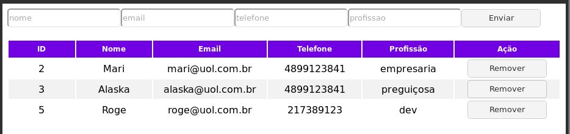

# Desafio-hub

#### Descrição:

Este projeto foi desenvolvido para o desafio proposto a hub-floripa durante o processo seletivo. 
O projeto sujere para fazer a criação de uma tabela que consiga adicionar e remover uma pessoa desta tabela. Para o desenvolvimento do projeto as regras são:
##### frontend:
Usar apenas HTML, CSS e JavaScript vanilla, não podendo usar frameworks.

##### backend:
Usando JAVA para criar a API RESTfull usando POST para inserir e DELETE para remover o usuário.
Usando apenas o Spring e o banco de dados SQL. Não podendo usar JPA ou hibernate. 

Os dados que devem conter nesta tabela são: id, nome, email, telefone, profissão. 

#### Como a tabela deveria ficar:

</img>

#### Resultado final da tabela:

## Executar o projeto na máquina local:
##### Server-side:
Para executar o projeto no lado do servidor precisa ter instalado em sua máquina a linguagem Java, Spring-boot e o MYsql. 

- Clone o projeto: `git clone git@github.com:Oldroge/Desafio-hub.git`   

- Entra na pasta clonada: `cd Desafio-hub`   

- Na raiz do projeto instale as dependências: `mvn install`   

- Ainda na raiz do projeto, execute: `mvn spring-boot:run`   

- Acesse a API através do: `http://localhost:8080/pessoas`

###### A api por enquanto aceita um GET, POST e DELETE, não sem possível fazer um PUT.

##### Cliente-side:
Usei a IDE Eclipse para desenvolver todo o projeto, no marketplace do eclipse é possível baixar o Eclipse Web Developer Tools, para auxiliar no desenvolvimento de HTML, CSS e Javascript. 
Quando abre o arquivo `.html` na própria IDE tem a uma aba web para ver a execução do projeto e ver seu funcionamento.  

Outra IDE de meu conhecimento que é possível executar esse frontend é o VSCode, dentro da IDE só precisa baixar o `live server` plugin.  
Com o arquivo `index.html` aberto clique em `live server` no canto inferior direito e abrirá a página no seu navegador padrão.